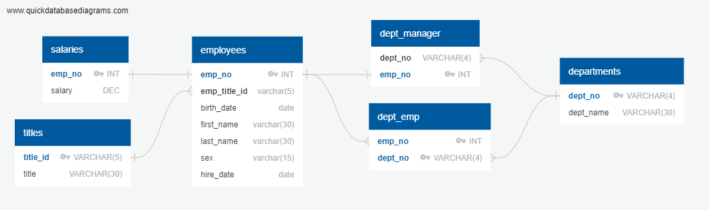
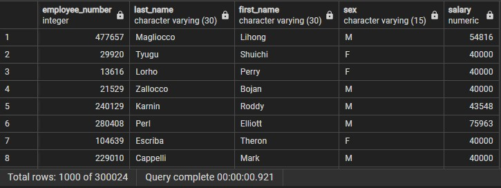
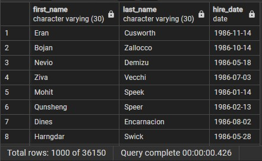
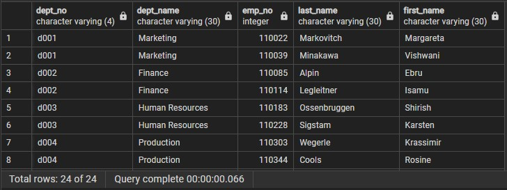
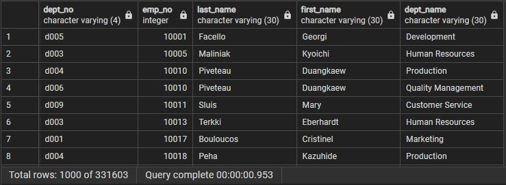
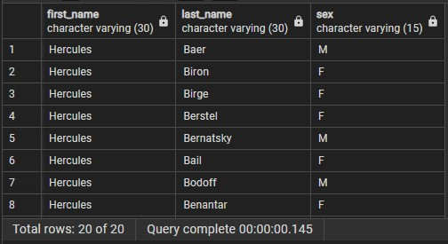
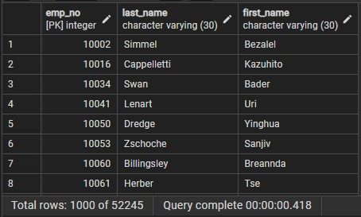
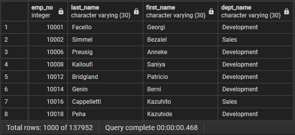
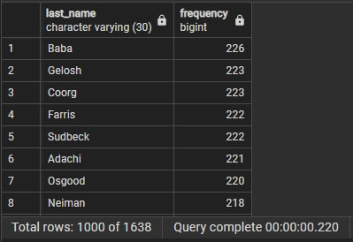

# sql-challenge
### - Overview
- Module 9 SQL Challenge files
- Author: Vinny Shankar
- Acknowledgements:
    - Study Groups: worked together with several students to understand the assignment
    - Classmates: [Hany Dief](https://github.com/hanydief), [Jed Miller](https://github.com/Jed-Miller), [Ahmed Abusamra](https://github.com/AbousamraEd), and [Jesús Jiménez](https://github.com/JesusJimenez3318) were instrumental in helping understand Entity Relationship Diagrams
    - Program: University of California Berkeley Data Analytics Bootcamp
    - Instructor: Ahmad Sweed
    - TA: Brian Perry
    - Tutor: Bethany Lindberg
### - Contents
- One folder containing:
    * An Image file of Entity Relationship Diagram (ERD)
    * A .sql file of Table Schemata
    * A .sql file of SQL Queries
    * A folder containing screenshots of SQL Query outputs
- .gitignore file
- This README.md file
### - Data Engineering:
- The Table Schemata file creates six tables that describe the organizational structure of a fictional company called "Pewlett Hackard." The tables are:
    * Departments
    * Titles
    * Employees
    * Department Employees
    * Department Managers
    * Salaries
- Entity Relationship Diagram (ERD)

- The Table Schemata also populates each table with data by copying from six .csv files (these files are not included in the repository).
### - Data Analysis Preview
- The following screenshots show previews of the SQL Queries' outputs.
- `Query 1`: List the employee number, last name, first name, sex, and salary of each employee          

- `Query 2`: List the first name, last name, and hire date for the employees who were hired in 1986         

- `Query 3`: List the manager of each department along with their department number, department name, employee number, last name, and first name            

- `Query 4`: List the department number for each employee along with that employee’s employee number, last name, first name, and department name            

- `Query 5`: List first name, last name, and sex of each employee whose first name is Hercules and whose last name begins with the letter B         

- `Query 6`: List each employee in the Sales department, including their employee number, last name, and first name         

- `Query 7`: List each employee in the Sales and Development departments, including their employee number, last name, first name, and department name           

- `Query 8`: List the frequency counts, in descending order, of all the employee last names (that is, how many employees share each last name)          
